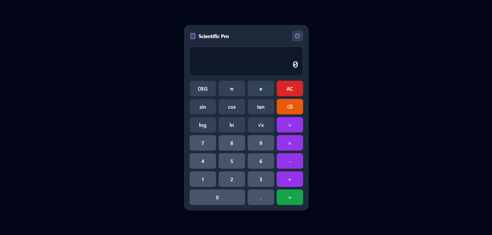

# Scientific-Calculator App

A web-based scientific calculator built with HTML, CSS, and JavaScript.

## 📱 App Preview

| Desktop View | 
| :---: |
|  | 

| Privacy Policy | 
| :---: |
|  |

| Mobile View |
| :---: |
|  | 

| Mobile Theme Editor View |
| :---: |
|  |

## 🚀 Features
* **Basic Math:** Addition, Subtraction, Multiplication, Division.
* **Advanced Functions:** Sin, Cos, Tan, Log, and Exponents.
* **Responsive Design:** Works on desktop and mobile devices.

## 🚀 How to Use
You can use the app directly in your browser!
1. Visit the live site here: [https://scientific-calculator-ten-sigma.vercel.app/]
2. Click the on-screen buttons to perform calculations.
3. You can also use your physical keyboard numbers and operators (+, -, *, /) to type quickly

## 📝 Privacy
This app does not collect any user data. See [privacy.html](privacy.html) for details.
